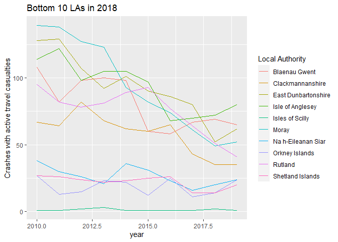
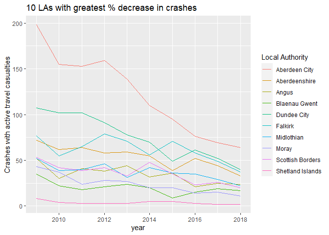

Local Authority Trend Analysis
================

THis short analysis is to highlight the variation in crashes affecting
active traveling across Great Britain.

Data comes from the Stats19 reports.

## Upper Tier Local Authorities and their population

We are using upper tier local authorities for this analysis as they tend
to be the local highway authority, thus have overall responsability for
road safety in their areas.

This first plot highlights the significant population and area variation
in LAs.

<!-- -->

## Crashes by LA

We can adjust the plots the KSI rate for population, England is clearly
doing worse than Scotland and Wales, particularly in the home counties.
No this is a count based on the most serious causality, so may slightly
overestimate the KSI rate. The City of London is an extreme outlier due
to it very low resident population.

<!-- --> The pattern
of slight casualties is different to the KSI

<!-- -->

    ##                         la_name rank ksi_per100k total_crash crash_fatal
    ## 93               City of London    1         566         151           0
    ## 125                 Westminster    2          80         827           3
    ## 112      Kensington and Chelsea    3          54         329           2
    ## 105      Hammersmith and Fulham    4          46         362           1
    ## 120                   Southwark    5          44         636           2
    ## 10  Kingston upon Hull, City of    6          43         384           3
    ## 99                       Camden    7          42         445           3
    ## 104                     Hackney    8          42         473           1
    ## 124                  Wandsworth    9          40         485           5
    ## 111                   Islington   10          39         426           2
    ## 201                     Torfaen  196           5          21           0
    ## 157          Na h-Eileanan Siar  197           5           3           1
    ## 195                    Bridgend  198           5          37           2
    ## 179         East Dunbartonshire  199           5          24           0
    ## 164              Orkney Islands  200           4           4           0
    ## 196           Vale of Glamorgan  201           3          36           0
    ## 166            Shetland Islands  202           2           2           2
    ## 162                       Moray  203           1          11           0
    ## 34             Bracknell Forest  204           1          26           1
    ## 50              Isles of Scilly  205           0           1           0

City of London and Westminster are probably distorted due to there high
daytime population. This emphasizes the need to adjust for the level of
active travel activity not just population.

# Historical Trends

Looking at absolute number of KSI, the top 10 and bottom 10 are the same
in 2009 and 2018 suggesting no overall change.

<!-- --><!-- -->

If we look for areas with the biggest change

<!-- --><!-- -->
There is a clear lesson that Scotland has done something significant in
terms of reducing KSI of active travelers especially in Aberdeen. At
this stage we cannot show if this is a true change in the crash rate or
a change in recording practices. Due to the gradual an continuous
decline it seems unlikely to be caused by a chang in data gatherin
policy. It may have been caused by a reduction in active travel.
