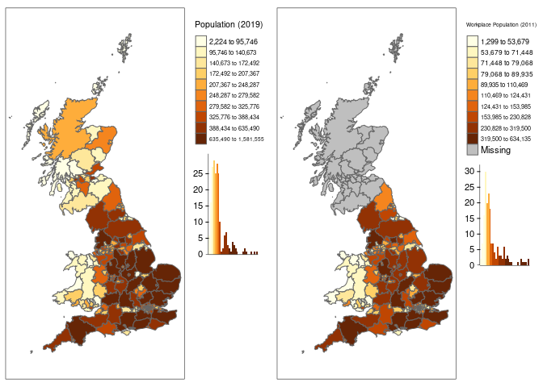
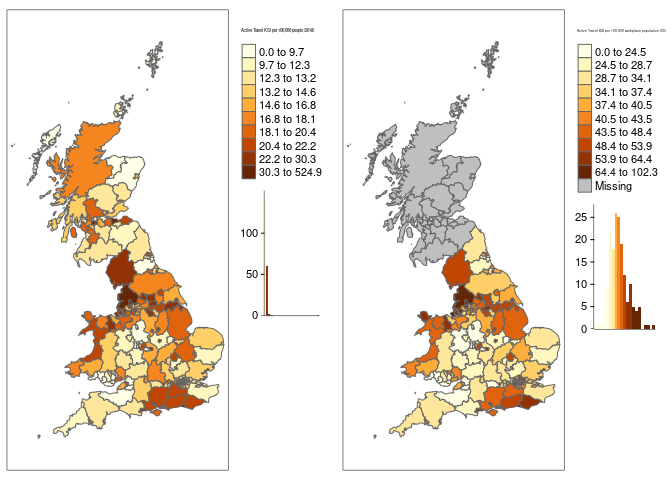

Local Authority Trend Analysis
================

This short analysis is to highlight the variation in crashes affecting
active traveling across Great Britain, and to try to understand the
variation in risk between different Local Authorities.

## Getting Data

First stage is to get the crash data, in this analysis we used the
stats19 data from 2010 to 2019 (the most recent 10 years) which has been
adjusted to account for the different causality reporting systems used
over that time.

We also use the 2019 Local authority boundaries and the 2019 population
estimates, for the workplace population we must used the 2011 census.

## Upper Tier Local Authorities and their population

We are using upper tier local authorities for this analysis as they tend
to be the local highway authority, thus have overall responsibility for
road safety in their areas.

This first plot highlights the significant population and area variation
in LAs.

<!-- -->

    ##  [1] "#FFFFE5" "#FFF7C0" "#FEE79B" "#FECF66" "#FEAD3B" "#F5851E" "#E0630D"
    ##  [8] "#BF4602" "#923204" "#662506"
    ##  [1] "#FFFFE5" "#FFF7C0" "#FEE79B" "#FECF66" "#FEAD3B" "#F5851E" "#E0630D"
    ##  [8] "#BF4602" "#923204" "#662506"

As LAs vary significantly in size, population, and character it is
unlikely that simply comparing the number of crashes or casualties will
be a fair comparison. Therefore it would be better to adjust the raw
crash rates to account for the local context.

## Crashes by LA in context

We have adjusted the plots to show the KSI rate of active travelers per
100,000 people (left plot uses resident population; right plot uses
workplace population). The KSI rate varies significantly with 90% of LAs
being between 8.2 and 24.1 per 100,000 resident population. Scotland has
notably low KSI rates, while Cumbria has a high rate.

<!-- -->

    ##  [1] "#FFFFE5" "#FFF7C0" "#FEE79B" "#FECF66" "#FEAD3B" "#F5851E" "#E0630D"
    ##  [8] "#BF4602" "#923204" "#662506"
    ##  [1] "#FFFFE5" "#FFF7C0" "#FEE79B" "#FECF66" "#FEAD3B" "#F5851E" "#E0630D"
    ##  [8] "#BF4602" "#923204" "#662506"

The City of London is an extreme outlier due to its very low resident
population. This highlights the denominator issue. The KSI rate is
depended on the value chosen as the denominator. In the case of the City
of London, the resident population of about 2,500 is not representative
of the amount of people traveling by road. A similar affect may be
taking place in Cumbria which is a popular tourist destination and may
have more active travelers than is represented by its population.

The right plot uses the 2011 census workplace population for England and
Wales. The workplace population favors areas like the City of London
which have high daytime activity but few nighttime residents. As people
working is a subset of all people KSI rates will naturally appear
higher. However the relative distribution of risk does change under a
workplace population approach suggesting that in at least some areas
this is an appropriate way to consider the data.

We can also compare the proportion of slight injuries vs the proportion
of KSI casualties. We are using weighting factors to estimate the
adjusted proportion of serious causalities caused by the historic use of
different reporting systems. However there may still be an impact of
different reporting practices across the country.

If this represents a genuine difference in safety, then LAs with a high
ratio (dark green) are having proportionally more slight casualties than
serious and fatal ones. This could be due to more segregation of active
travelers from motor traffic, lower traffic speed or greater driver
awareness of active travelers.

<!-- -->

    ## [1] "#D4BCDB" "#DFCAE3" "#EADBEB" "#EFE5EF" "#E8F3E4" "#BFE5B9" "#80C480"
    ## [8] "#3A934C" "#0D5D28"

### Top and Bottom LAs

This table lists the top 10 and bottom 10 LAs for Active Travel KSI per
100,000 resident population.

|     | la\_name                    | rank | active\_ksi\_per100k | total\_crash | crash\_fatal |
|:----|:----------------------------|-----:|---------------------:|-------------:|-------------:|
| 93  | City of London              |    1 |                  525 |          229 |            1 |
| 125 | Westminster                 |    2 |                   73 |         1552 |            3 |
| 112 | Kensington and Chelsea      |    3 |                   48 |          668 |            3 |
| 42  | Portsmouth                  |    4 |                   46 |          485 |            3 |
| 120 | Southwark                   |    5 |                   40 |         1237 |            3 |
| 105 | Hammersmith and Fulham      |    6 |                   38 |          734 |            1 |
| 104 | Hackney                     |    7 |                   38 |          906 |            2 |
| 10  | Kingston upon Hull, City of |    8 |                   37 |          806 |            5 |
| 9   | Blackpool                   |    9 |                   36 |          304 |            2 |
| 41  | Brighton and Hove           |   10 |                   36 |          686 |            2 |
| 157 | Na h-Eileanan Siar          |  196 |                    8 |           20 |            1 |
| 194 | Neath Port Talbot           |  197 |                    8 |          164 |            3 |
| 201 | Torfaen                     |  198 |                    8 |           77 |            1 |
| 171 | Aberdeenshire               |  199 |                    8 |          238 |            8 |
| 195 | Bridgend                    |  200 |                    7 |          165 |            5 |
| 146 | Staffordshire               |  201 |                    6 |         1017 |           23 |
| 196 | Vale of Glamorgan           |  202 |                    6 |          143 |            1 |
| 34  | Bracknell Forest            |  203 |                    3 |          107 |            3 |
| 162 | Moray                       |  204 |                    3 |           49 |            5 |
| 50  | Isles of Scilly             |  205 |                    0 |            2 |            0 |

As mention above City of London and Westminster are probably distorted
due to their high daytime population. This emphasizes the need to adjust
for the level of active travel activity not just population. Ranking by
workplace population gives slightly different results.

|     | la\_name                    | rank | active\_ksi\_per100k\_work | total\_crash | crash\_fatal |
|:----|:----------------------------|-----:|---------------------------:|-------------:|-------------:|
| 104 | Hackney                     |    1 |                        102 |          906 |            2 |
| 42  | Portsmouth                  |    2 |                         91 |          485 |            3 |
| 124 | Wandsworth                  |    3 |                         90 |          981 |            6 |
| 9   | Blackpool                   |    4 |                         79 |          304 |            2 |
| 106 | Haringey                    |    5 |                         79 |          832 |            2 |
| 10  | Kingston upon Hull, City of |    6 |                         77 |          806 |            5 |
| 41  | Brighton and Hove           |    7 |                         77 |          686 |            2 |
| 8   | Blackburn with Darwen       |    8 |                         76 |          359 |            2 |
| 43  | Southampton                 |    9 |                         74 |          537 |            3 |
| 114 | Lambeth                     |   10 |                         74 |         1203 |            1 |
| 201 | Torfaen                     |  164 |                         20 |           77 |            1 |
| 84  | Solihull                    |  165 |                         20 |          259 |            5 |
| 197 | Cardiff                     |  166 |                         19 |          362 |            5 |
| 25  | South Gloucestershire       |  167 |                         18 |          432 |            5 |
| 195 | Bridgend                    |  168 |                         17 |          165 |            5 |
| 196 | Vale of Glamorgan           |  169 |                         17 |          143 |            1 |
| 146 | Staffordshire               |  170 |                         15 |         1017 |           23 |
| 93  | City of London              |  171 |                         14 |          229 |            1 |
| 34  | Bracknell Forest            |  172 |                          6 |          107 |            3 |
| 50  | Isles of Scilly             |  173 |                          0 |            2 |            0 |

# Historical Trends

Looking at absolute number of KSI, the top 10 and bottom 10 are the same
in 2010 and 2019 suggesting no overall change. The plot blow shows the
Active Travel KSI rate per 100,000 workplace population from 2010 to
2019. The majority of LAs are shown with the thin grey lines, while the
top 5 and bottom 5 LAs are highlighted in colour.

<!-- -->

The KSI rates fluctuate significantly per year, this reflects the noisy
nature of crash data, especially for the subset of crashes that involve
an active traveler who is killed or seriously injured. Note that this
plot excluded Scotland.

If we look for areas with the biggest change in KSI rates between 2010
and 2019 we can see some weak noisy trends, with areas such a Torbay
appearing to increase in KSIs and Stoke on Trent declining.

<!-- -->

If we instead compare KSI against the resident population (adding in
Scotland to the analysis) we can see that Aberdeen City have made a
sustained decline in KSI rates over the last ten years, down over 60%
from their high in 2011. Unlike some other LAs where the rate appears
variable but steady, the KSI rate in Aberdeen has fallen almost every
year and thus may represent a real world change in safety worthy of
detailed study. In particular the Launch of Scotland’s Road Safety
Framework in 2009 may have been successful in reducing Active Travel
KSIs.

<!-- -->

## Temporal Analysis

If we consider when active travelers are most likely to be injured, it
may provide insights into the causes of these crashes.

<!-- -->

First we can consider the time of day. This plot show the total number
of Active Travelers KSI between 2010 and 2019 for each hour of the day
in Great Britain. There are clear spikes around the morning and
afternoon rush hours and reduced levels during the night. This graph
largely reflect the general pattern of traffic though the day. There are
a greater number of active traveller casualties during the PM peak
commuting and school run hours (roughly 15:00 - 19:00 PM) as compared to
the morning rush hour. This may perhaps be related to the higher
likelihood that people are travelling in darkness or poor light
conditions in these hours, or because travellers are more tired at this
time.

<!-- -->

Consider change through the year, this plot shows the number of Active
Travellers KSI between 2010 and 2019 for each day of the year in Great
Britain. The trend is mostly fairly stable with a pronounced low point
at Christmas (day 360), when few people travel. Similarly, rates are
relatively low in early April, around the average date of Easter (day
90-100). KSI rates appear to decline over the summer (days 180 - 240)
before rising sharply in September. This may reflect a change in travel
behavior around the start of the new school year.

The highest active traveller KSI rates are in November and early
December (days 300 - 350), which may be related to the early sunsets and
dark evenings at this time of year. Although the shortest day of the
year is typically 21st December, the earliest sunset occurs on 12/13th
December.

<!-- -->

Selecting a few LAs we can see the the distribution of casualties
through the year varies a little for place to place. Notably, Cumbria’s
casualties are highest in early August, peak tourism season.

## Hour and day of year

Looking at the distribution of active traveller KSI casualties over both
hour and day of year, we can see that the number of casualties in the
peak morning hour of 8-9am is high across most of the year, with the
exception of the Christmas, Easter and Summer periods. However,
casualties during the hour 5-6pm are highest in Days 300-350 and Days
5-40 (November, December and January, except the Christmas period),
suggesting that the darker winter evenings are playing a role here.
Casualties during the hour 4-5pm are highest in Days 320-350, further
backing up this observation.

    ##     fiveday           hour         active_ksi    
    ##  Min.   :  0.0   Min.   : 0.00   Min.   :  1.16  
    ##  1st Qu.: 90.0   1st Qu.: 5.75   1st Qu.: 25.24  
    ##  Median :182.5   Median :11.50   Median : 67.57  
    ##  Mean   :182.5   Mean   :11.50   Mean   : 70.54  
    ##  3rd Qu.:275.0   3rd Qu.:17.25   3rd Qu.: 99.47  
    ##  Max.   :365.0   Max.   :23.00   Max.   :247.16

<!-- -->

## Hours of darkness

Look at actual light levels crashes\_all$light\_conditions

# Focus on Cycling Commuting Times

As we have the best data for cycling activity during commuting times
(via the PCT), we have filtered the data in this section to only
consider crashes between 7am - 10am and 4pm - 7pm. We have removed the
data from non-peak commute hours to look at how the remaining KSI
collisions correspond with the LA workplace population. This more
accurately represents the safety of travel to work. We can see that
tourist hotspots like Cumbria now show slightly lower KSI rates,
suggesting that a higher proportion of collisions happen outside peak
hours there. Lancashire retains a high rate, but the highest collision
rates are now in small urban LAs with high cycle commuting, including
Wandsworth, Hackney and Portsmouth.

<!-- -->

    ##  [1] "#FFFFE5" "#FFF7C0" "#FEE79B" "#FECF66" "#FEAD3B" "#F5851E" "#E0630D"
    ##  [8] "#BF4602" "#923204" "#662506"

|     | la\_name                     | rank | active\_ksi\_per100k\_work | total\_crash | crash\_fatal |
|:----|:-----------------------------|-----:|---------------------------:|-------------:|-------------:|
| 124 | Wandsworth                   |    1 |                         44 |          445 |            2 |
| 104 | Hackney                      |    2 |                         37 |          338 |            1 |
| 42  | Portsmouth                   |    3 |                         36 |          193 |            1 |
| 119 | Richmond upon Thames         |    4 |                         36 |          217 |            0 |
| 10  | Kingston upon Hull, City of  |    5 |                         35 |          347 |            2 |
| 41  | Brighton and Hove            |    6 |                         34 |          297 |            1 |
| 106 | Haringey                     |    7 |                         33 |          302 |            1 |
| 9   | Blackpool                    |    8 |                         31 |          130 |            0 |
| 103 | Greenwich                    |    9 |                         30 |          306 |            5 |
| 69  | St. Helens                   |   10 |                         30 |           91 |            4 |
| 48  | Shropshire                   |  164 |                          8 |          183 |            2 |
| 193 | Swansea                      |  165 |                          7 |           98 |            0 |
| 196 | Vale of Glamorgan            |  166 |                          7 |           49 |            0 |
| 21  | Stoke-on-Trent               |  167 |                          7 |          156 |            0 |
| 146 | Staffordshire                |  168 |                          7 |          393 |            4 |
| 22  | Bath and North East Somerset |  169 |                          7 |          111 |            0 |
| 53  | Central Bedfordshire         |  170 |                          6 |          258 |            4 |
| 195 | Bridgend                     |  171 |                          4 |           60 |            1 |
| 34  | Bracknell Forest             |  172 |                          2 |           51 |            1 |
| 50  | Isles of Scilly              |  173 |                          0 |            1 |            0 |

Commuter hours are classified as 07:00-10:00 and 16:00-19:00.

# Speed limits

Look at roads where the speed limit has changed. Have collision rates
changed?

# Change in cycling

Present the GAM results on change in cycling across England

Use the GAM results to look at change in cycling v change in casualties
