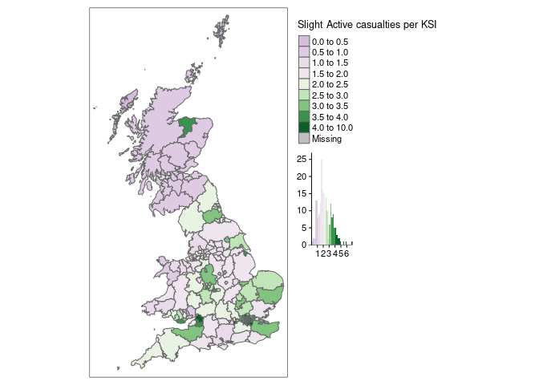

Local Authority Trend Analysis
================

THis short analysis is to highlight the variation in crashes affecting
active traveling across Great Britain.

Data comes from the Stats19 reports.

## Getting Data

First stage is to get the crash data, in this analysis we used the
stats19 data from 2010 to 2019 (the most recent 10 years) which has been
adjusted to account for the different causality reporting systems used
over that time.

We also use the 2019 Local authority boundaries and the 2019 population
estimates, for the workplace population we must used the 2011 census.

## Upper Tier Local Authorities and their population

We are using upper tier local authorities for this analysis as they tend
to be the local highway authority, thus have overall responsibility for
road safety in their areas.

This first plot highlights the significant population and area variation
in LAs.

    ## Legend labels were too wide. The labels have been resized to 0.56, 0.48, 0.45, 0.45, 0.45, 0.45, 0.45, 0.45, 0.45, 0.41. Increase legend.width (argument of tm_layout) to make the legend wider and therefore the labels larger.

    ## Some legend labels were too wide. These labels have been resized to 0.56, 0.51, 0.51, 0.51, 0.48, 0.45, 0.45, 0.45, 0.45, 0.45. Increase legend.width (argument of tm_layout) to make the legend wider and therefore the labels larger.

<!-- -->

## Crashes by LA

We can adjust the plots the KSI rate for population, England is clearly
doing worse than Scotland and Wales, particularly in the home counties.
No this is a count based on the most serious causality, so may slightly
overestimate the KSI rate. The City of London is an extreme outlier due
to it very low resident population.

<!-- --> The pattern
of slight casualties is different to the KSI. This pa account for the
adjusted proportion of serious causalities caused by the historic use of
different reporting systems. However this difference may still be due to
different reporting practices across the country.

If this represent a genuine difference in safety, then LAs with a high
ratio (dark green) are having proportionally more slight casualties than
serious and fatal ones. This could be use to more segregation of active
travelers from motor traffic, lower traffic speed or greater driver
awareness of active travellers.

<!-- -->

    ##                         la_name rank active_ksi_per100k total_crash crash_fatal
    ## 93               City of London    1                525         229           1
    ## 125                 Westminster    2                 73        1553           3
    ## 112      Kensington and Chelsea    3                 48         668           3
    ## 42                   Portsmouth    4                 40         485           3
    ## 120                   Southwark    5                 40        1237           3
    ## 41            Brighton and Hove    6                 39         686           2
    ## 105      Hammersmith and Fulham    7                 38         733           1
    ## 104                     Hackney    8                 38         906           2
    ## 10  Kingston upon Hull, City of    9                 37         807           5
    ## 111                   Islington   10                 36         796           2
    ## 201                     Torfaen  196                  7          77           1
    ## 165            Scottish Borders  197                  7         174          12
    ## 146               Staffordshire  198                  6        1017          23
    ## 179         East Dunbartonshire  199                  6          52           0
    ## 195                    Bridgend  200                  6         165           5
    ## 164              Orkney Islands  201                  5          14           2
    ## 196           Vale of Glamorgan  202                  4         144           1
    ## 162                       Moray  203                  3          49           5
    ## 34             Bracknell Forest  204                  2         107           3
    ## 50              Isles of Scilly  205                  0           2           0

City of London and Westminster are probably distorted due to there high
daytime population. This emphasizes the need to adjust for the level of
active travel activity not just population. Ranking by workplace
population gives slightly different results.

    ##                         la_name rank active_ksi_per100k_work total_crash
    ## 104                     Hackney    1                     102         906
    ## 124                  Wandsworth    2                      90         981
    ## 41            Brighton and Hove    3                      84         686
    ## 106                    Haringey    4                      79         832
    ## 42                   Portsmouth    5                      78         485
    ## 10  Kingston upon Hull, City of    6                      77         807
    ## 114                     Lambeth    7                      74        1203
    ## 120                   Southwark    8                      69        1237
    ## 119        Richmond upon Thames    9                      69         454
    ## 94         Barking and Dagenham   10                      67         561
    ## 174                Renfrewshire  196                      NA         211
    ## 175         West Dunbartonshire  197                      NA          83
    ## 176                West Lothian  198                      NA         280
    ## 177                       Angus  199                      NA         126
    ## 178                 Dundee City  200                      NA          99
    ## 179         East Dunbartonshire  201                      NA          52
    ## 180                        Fife  202                      NA         325
    ## 181           Perth and Kinross  203                      NA         180
    ## 182                Glasgow City  204                      NA         919
    ## 183           North Lanarkshire  205                      NA         365
    ##     crash_fatal
    ## 104           2
    ## 124           6
    ## 41            2
    ## 106           2
    ## 42            3
    ## 10            5
    ## 114           1
    ## 120           3
    ## 119           2
    ## 94            1
    ## 174           4
    ## 175           1
    ## 176           4
    ## 177           2
    ## 178           1
    ## 179           0
    ## 180           9
    ## 181          13
    ## 182           9
    ## 183           5

# Focus on Cycling Communitng Times

As we have the best data for cycling activity during communing times
(via the PCT), we have filtered the data in this section to only
conisder crashes between 7am - 10am and 4pm - 7pm.

# Historical Trends

Looking at absolute number of KSI, the top 10 and bottom 10 are the same
in 2009 and 2018 suggesting no overall change.

    ## Warning: Removed 330 row(s) containing missing values (geom_path).

<!-- -->

If we look for areas with the biggest change

    ## Warning: Removed 55 row(s) containing missing values (geom_path).

<!-- --> There is a clear
lesson that Scotland has done something significant in terms of reducing
KSI of active travelers especially in Aberdeen. At this stage we cannot
show if this is a true change in the crash rate or a change in recording
practices. Due to the gradual an continuous decline it seems unlikely to
be caused by a change in data gatherin policy. It may have been caused
by a reduction in active travel.

## Looking at commuting times

We can filter out the non-commuting crashes and look at the LA workplace
population.

commutert 7 am - 10 am 4 - 7 pm
