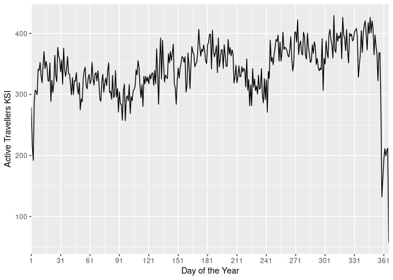
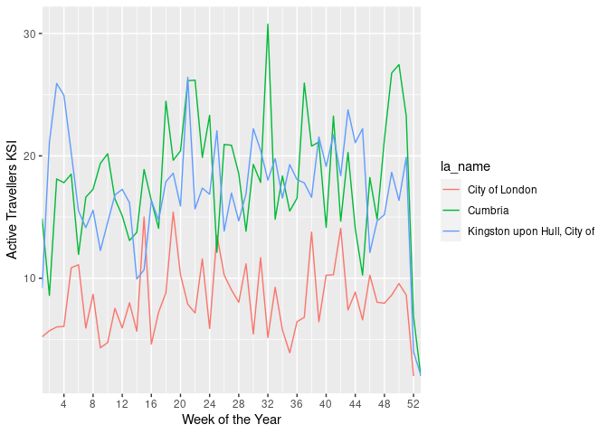

Local Authority Trend Analysis
================

This short analysis is to highlight the variation in crashes affecting
active traveling across Great Britain, and to try to understand the
variation in risk between different Local Authorities.

## Getting Data

First stage is to get the crash data, in this analysis we used the
stats19 data from 2010 to 2019 (the most recent 10 years) which has been
adjusted to account for the different causality reporting systems used
over that time.

We also use the 2019 Local authority boundaries and the 2019 population
estimates, for the workplace population we must used the 2011 census.

## Upper Tier Local Authorities and their population

We are using upper tier local authorities for this analysis as they tend
to be the local highway authority, thus have overall responsibility for
road safety in their areas.

This first plot highlights the significant population and area variation
in LAs.

    ## Legend labels were too wide. The labels have been resized to 0.56, 0.48, 0.45, 0.45, 0.45, 0.45, 0.45, 0.45, 0.45, 0.41. Increase legend.width (argument of tm_layout) to make the legend wider and therefore the labels larger.

    ## Some legend labels were too wide. These labels have been resized to 0.56, 0.51, 0.51, 0.51, 0.48, 0.45, 0.45, 0.45, 0.45, 0.45. Increase legend.width (argument of tm_layout) to make the legend wider and therefore the labels larger.

<!-- -->

As LAs vary signifianct is size, population, and character it is
unlikely that simple comparing the number of crashes or casualties will
be a far comparison. Therefore it would be better to adjust the raw
crash rates to account for the local context.

## Crashes by LA in context

We have adjusted the plots to show KSI rate of active travlers per
100,000 people (left map). The KSI rate varies signiicantly with 90% of
LAs being between 8.2 and 24.1 per 100,000 people. Scotland has notably
low KSI rates while, Cumbria, has a very high rate.

<!-- -->

The City of London is an extreme outline due to it very low resident
population. This highlights the denominator issue. That the KSI rate is
depended on the value chosen as the denominator. In the case of the City
of London, the resident population of about 2,500 is not representative
of the amount of people traveling by road. A similar affect may be
taking place in Cumbria which is a popular tourist destination and may
have more active travelers than is represented by its population.

The right plot uses the 2011 census workplace population for England and
Wales. The workplace population favors areas like the City of London
which have high daytime activity but few nighttime residents. As people
working is a subset of all people KSI rates will naturally appear
higher. However the relative distribution of risk does change under a
workplace population approach suggesting that in at least some areas
this is an appropriate way to consider the data.

We can also compare the proportion of slightly injured people vs the
proportion of KSI casualties. This we are using the weighting factors to
account for the adjusted proportion of serious causalities caused by the
historic use of different reporting systems. However this difference may
still be due to different reporting practices across the country.

If this represent a genuine difference in safety, then LAs with a high
ratio (dark green) are having proportionally more slight casualties than
serious and fatal ones. This could be use to more segregation of active
travelers from motor traffic, lower traffic speed or greater driver
awareness of active travelers.

<!-- --> \#\#\# Top
and Bottom LAs

This table lists the top 10 and bottom 10 LAs for Active Travel KSI per
100,000 resident population.

    ##                         la_name rank active_ksi_per100k total_crash crash_fatal
    ## 93               City of London    1                525         229           1
    ## 125                 Westminster    2                 73        1553           3
    ## 112      Kensington and Chelsea    3                 48         668           3
    ## 42                   Portsmouth    4                 46         485           3
    ## 120                   Southwark    5                 40        1237           3
    ## 105      Hammersmith and Fulham    6                 38         733           1
    ## 104                     Hackney    7                 38         906           2
    ## 10  Kingston upon Hull, City of    8                 37         807           5
    ## 9                     Blackpool    9                 36         304           2
    ## 41            Brighton and Hove   10                 36         686           2
    ## 157          Na h-Eileanan Siar  196                  8          20           1
    ## 194           Neath Port Talbot  197                  8         164           3
    ## 201                     Torfaen  198                  8          77           1
    ## 171               Aberdeenshire  199                  8         238           8
    ## 195                    Bridgend  200                  7         165           5
    ## 146               Staffordshire  201                  6        1017          23
    ## 196           Vale of Glamorgan  202                  6         144           1
    ## 34             Bracknell Forest  203                  3         107           3
    ## 162                       Moray  204                  3          49           5
    ## 50              Isles of Scilly  205                  0           2           0

As mention above City of London and Westminster are probably distorted
due to there high daytime population. This emphasizes the need to adjust
for the level of active travel activity not just population. Ranking by
workplace population gives slightly different results.

    ##                         la_name rank active_ksi_per100k_work total_crash
    ## 104                     Hackney    1                     102         906
    ## 42                   Portsmouth    2                      91         485
    ## 124                  Wandsworth    3                      90         981
    ## 9                     Blackpool    4                      79         304
    ## 106                    Haringey    5                      79         832
    ## 10  Kingston upon Hull, City of    6                      77         807
    ## 41            Brighton and Hove    7                      77         686
    ## 8         Blackburn with Darwen    8                      76         359
    ## 43                  Southampton    9                      74         537
    ## 114                     Lambeth   10                      74        1203
    ## 201                     Torfaen  164                      20          77
    ## 84                     Solihull  165                      20         259
    ## 197                     Cardiff  166                      19         361
    ## 25        South Gloucestershire  167                      18         432
    ## 195                    Bridgend  168                      17         165
    ## 196           Vale of Glamorgan  169                      17         144
    ## 146               Staffordshire  170                      15        1017
    ## 93               City of London  171                      14         229
    ## 34             Bracknell Forest  172                       6         107
    ## 50              Isles of Scilly  173                       0           2
    ##     crash_fatal
    ## 104           2
    ## 42            3
    ## 124           6
    ## 9             2
    ## 106           2
    ## 10            5
    ## 41            2
    ## 8             2
    ## 43            3
    ## 114           1
    ## 201           1
    ## 84            5
    ## 197           5
    ## 25            5
    ## 195           5
    ## 196           1
    ## 146          23
    ## 93            1
    ## 34            3
    ## 50            0

# Historical Trends

Looking at absolute number of KSI, the top 10 and bottom 10 are the same
in 2010 and 2019 suggesting no overall change. The plot blow shows the
Active Travel KSI rate per 100,000 workplace population from 2010 to
2019. The majority of LAs are shwon with the thin grey lines, while the
top 5 and bottom 5 LAs are highlighted in colour.

    ## Warning: Removed 330 row(s) containing missing values (geom_path).

<!-- -->

The KSI rates fluctuate significantly per year, this reflects the noisy
nature of crash data, especially for the subset of crashes that involve
an active travelers who is killed or seriously injured. Note that this
plot excluded Scotland.

If we look for areas with the biggest change in KSI rates between 2010
and 2019 we can see some weak noisy trends, with areas such a Torbay
appreasing to increas in KSIs and Stoke on Trent declining.

    ## Warning: Removed 330 row(s) containing missing values (geom_path).

<!-- --> If we instead
compare KSI against the resident population (adding in Scotland to the
analysis) we can see that Aberdeen City have made a sustained decline in
KSI rates over the last ten years, down over 60% from their high in
2011. Unlike some other LAs where the rate appears variable but steady,
the KSI rate in Aberdeen has fallen almost every year and thus may
represent a real world change in safety worthy of detailed study. In
particular the Launch of Scotland’s Road Safety Framework in 2009 may
have been successful in reducing Active Travel KSIs.

    ## Scale for 'y' is already present. Adding another scale for 'y', which will
    ## replace the existing scale.

    ## Warning: Removed 190 row(s) containing missing values (geom_path).

<!-- -->

## Temporal Analysis

If we consider when active travelers are most likely to be injured, it
may provide insights into the causes of these crashes.

    ## Warning: Removed 132 rows containing missing values (position_stack).

<!-- -->

First we can consider the time of day. This plot show the total number
of Active Travelers KSI between 2010 and 2019 for each hour of the day
in Great Britain. There are clear spikes around the morning and
afternoon rush hours and reduced levels during the night. This graph
largely reflect the general pattern of traffic though the day.

    ## Warning: `fun.y` is deprecated. Use `fun` instead.

    ## Warning: Removed 132 rows containing non-finite values (stat_summary).

<!-- -->

Consider change through the year, this plot shows the number of of
Active Travelers KSI between 2010 and 2019 for each day of the year in
Great Britain. The trend is mostly stable with low point around
Christmas (day 360). KSI rates appear to decline over the summer (days
180 - 240) before rising sharply in September. This may reflect a change
in travel behavior around the start of the new school year.

<!-- --> Selecting a
few LAs we can see the the distribution of casualties through the year
varies a little for place to place. Notable Cumbria’s casualties are
highest in early August, peek tourism season.

## Looking at commuting times

We can filter out the non-commuting crashes and look at the LA workplace
population.

commutert 7 am - 10 am 4 - 7 pm

# Focus on Cycling Communitng Times

As we have the best data for cycling activity during communing times
(via the PCT), we have filtered the data in this section to only
conisder crashes between 7am - 10am and 4pm - 7pm.
