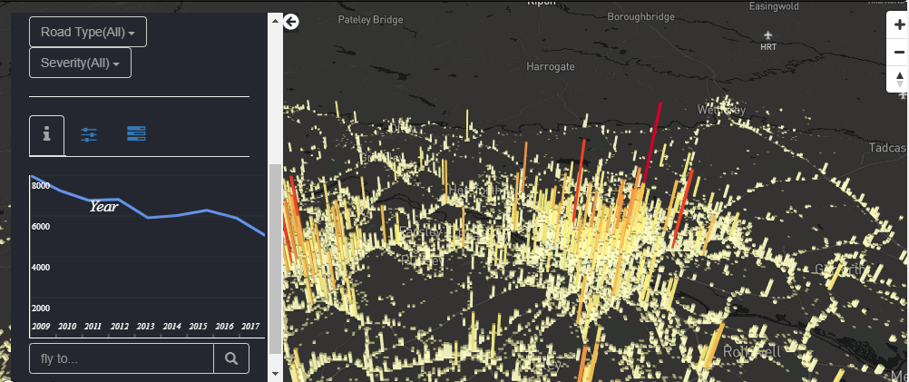

<!-- README.md is generated from README.Rmd. Please edit that file -->
<!-- Plan: apply to this call: https://roadsafetytrust.org.uk/wp-content/uploads/2019/03/Final-GT01-Grants-Policy-February-2019.pdf -->

```{r, include = FALSE}
remotes::install_github("Robinlovelace/gitgantt")
knitr::opts_chunk$set(
  collapse = TRUE,
  comment = "#>",
  echo = FALSE,
  out.width = "100%"
)
library(tidyverse)
library(stats19)
f = list.files(path = ".", pattern = "lovelace|jamson|beech|hama", ignore.case = TRUE)
piggyback::pb_upload(f)
```

# Background

<!-- *Please refer to relevant research and literature (where available) and any gaps in knowledge and explain how the proposal develops or adds to learning. Please also describe the extent of current provision or implementation of the measures the proposal seeks to develop and current evidence (if any) for their effectiveness.* -->

Active transport can tackle some of the most pressing issues of the 21^st^ century, including air pollution, the obesity epidemic, and transport-related social exclusion [@lucas_running_2004; @johansson_impacts_2017; @saunders_what_2013].
Recognising these wide ranging benefits, the government has ambitious targets for active transport, as outlined in the Cycling and Walking Investment Strategy (CWIS): to double the number of stages cycled compared with the baseline year of 2013, and "reverse the decline in walking" [@departmentfortransport_cycling_2017].
Notably, the government aims to double cycling *whilst simultaneously reducing the number of people killed or seriously injured per billion km cycled year-on-year*.

Data on cycling rates and future investment plans suggest that the cycling uptake target will be difficult to achieve [@roadsafetygb_government_2019].
Much research funded in support of the CWIS, such as the Propensity to Cycle Tool [@lovelace_propensity_2017], has focussed on boosting walking and cycling levels, with relatively little attention paid to safety, despite the fact that cycling and walking casualties have not fallen since the CWIS baseline year of 2013 (see Figure 1).
Safety is a major barrier to greater uptake of cycling and walking [@horton_fear_2016; @jacobsen_who_2009], with fear of collisions and "too much traffic" being the top two reasons cited in DfT research [@nathan_cycling_2019].
<!-- ^[ -->
<!-- https://www.rospa.com/rospaweb/docs/events/past-events/road-safety-conference-2019/jai-nathan.pdf -->
<!-- ] -->


<!-- ## Road safety interventions -->

The research outlined in the previous paragraph suggests that road safety measures can be an effective way of meeting both the active travel uptake *and* the road safety targets in the CWIS.
This raises the question: which road safety measures work best to protect pedestrians and cyclists?
Recent research has found that a range of traffic calming measures can reduce casualty rates, including '20 mph limits' (implemented only via signalling) and '20 mph zones' (which can include optional measures including speed cameras) [@maher_20mph_2018; @rospa_guide_2019], 'filtered permeability' interventions including and rising and fixed bollards, and a range of speed humps.
A range of additional traffic calming measures is described in the DfT's Local Transport Note (LTN) 01/07 [@departmentfortransport_traffic_2007].
The focus of this study will be on three types of intervention, because these have received attention from the perspective of active travel [@mulvaney_cycling_2015], and because data on their spatial (and in some cases date of implementation) is relatively abundant:

- 20 mph zones, which are well documented in a recent study by @maher_20mph_2018, and local case studies published for Bristol [@bornioli_effectiveness_2018] and Greater London [@sarkar_street_2018]. 
<!-- Geographic data has been made available on the distribrution of Glasgow's extensive 20 mph zones.^[ -->
<!-- See http://www.gosafeglasgow.com/news/20-mph-zones. -->
<!-- ] -->
Data on the spatial extent, attributes and time of implementation of 20 mph zones will be collated from a range of sources, including via .gov.uk websites, newspaper articles and OpenStreetMap, building on research estimating the accuracy of crowd-sourced road data [@barrington-leigh_world_2017].
<!-- ^[ -->
<!-- The road charity Brake has informally offered to support the project with data provision. -->
<!-- ] -->
<!-- - 20 mph limits, which are often single roads with 20 mph signs. OpenStreetMap, which is increasingly complete for roads [@barrington-leigh_worlds_2017], will be used to identify these, with appropriate care taken to assess the reliability of the data. -->

- Physical traffic calming measures, including the location of speed cameras and speed hump data from local authorities OpenStreetMap.
- Filtered permeability, which will be measured on a sliding scale reporting connectivity for pedestrians and cyclists, relative to motorised modes.

Reproducible code that accesses, cleans and stores intervention data will be published in an R package, with the working title of **trafficcalmr**.
This will lead to a *step change* in knowledge on how to access and process historic road calming intervention data, filling an important gap in current knowledge, and providing a robust evidence base on which future interventions can be prioritised and monitored.


```{r, eval=FALSE, warning=FALSE}
devtools::install_github("thomasp85/patchwork")
# install.packages("ggthemes")
# ggthemes::theme_igray()
devtools::install_github("cttobin/ggthemr")
accidents = map_dfr(2013:2019, get_stats19, "ac", ask = FALSE)
casualties = map_dfr(2013:2019, get_stats19, "cas", ask = FALSE)
cas = left_join(accidents, casualties)
saveRDS(cas, "cas.Rds") # 31 MB
cas$month = lubridate::round_date(cas$date, unit = "month")
cas_monthly = cas %>%
  group_by(month) %>%
  summarise(
    Total_Slight = sum(accident_severity == "Slight"),
    Pedestrian_Slight = sum(accident_severity == "Slight" & casualty_type == "Pedestrian", na.rm = TRUE),
    Cyclist_Slight = sum(accident_severity == "Slight" & casualty_type == "Cyclist", na.rm = TRUE),
    Total_Serious = sum(accident_severity == "Serious"),
    Pedestrian_Serious = sum(accident_severity == "Serious" & casualty_type == "Pedestrian", na.rm = TRUE),
    Cyclist_Serious = sum(accident_severity == "Serious" & casualty_type == "Cyclist", na.rm = TRUE),
    Total_Fatal = sum(accident_severity == "Fatal"),
    Pedestrian_Fatal = sum(accident_severity == "Fatal" & casualty_type == "Pedestrian", na.rm = TRUE),
    Cyclist_Fatal = sum(accident_severity == "Fatal" & casualty_type == "Cyclist", na.rm = TRUE),
  )
cas_monthly = cas_monthly[-1, ]
cas_monthly = cas_monthly[-nrow(cas_monthly), ]
cas_long = gather(cas_monthly, Collision_type, Number, -month)
cas_long = cas_long %>% separate(data = ., col = Collision_type, into = c("Mode", "Severity"), sep = "_")
saveRDS(cas_long, "cas_long.Rds")
piggyback::pb_upload("cas_long.Rds")
```

```{r trend, warning=FALSE, fig.height=3.5, fig.cap="Active transport casualties have flatlined. Monthly casualty rates by mode and severity (top) and distance travelled by active modes across Great Britain, start of 2013 to end of 2019 (crash data) and start of 2013 to end of 2017 (travel data). Credit: ITS Leeds, using the stats19 R package, ONS population estimates, and the National Travel Survey summary statistics (NTS0303).", echo=FALSE, message=FALSE}
ggthemr::ggthemr(palette = "flat")
cas_long = readRDS("cas_long.Rds")
# ggplot(cas_long) +
#   geom_line(aes(month, Number)) +
#   facet_grid(Severity ~ Mode) +
#   scale_y_log10() +
#   ylab("Casualties/month (log scale)") +
#   xlab("Date")
# ggsave("national-overview.png")
# Alternative with colours for crash types
cas_long = cas_long %>% 
  filter(Mode != "Total")
p1 = ggplot(cas_long) +
  geom_line(aes(month, Number, colour = Severity)) +
  facet_grid(. ~ Mode) +
  scale_y_log10() +
  ylab("Casualties/month") +
  xlab("")
active_distance_km = readr::read_csv("gb-cycled-long.csv")
active_distance_km = active_distance_km %>% 
  filter(Year > 2012)
names(active_distance_km) = c("Cyclist", "Pedestrian", "Date")
active_long = gather(active_distance_km, Mode, Distance, -Date)
active_long$Date = active_long$Date + 0.5
p2 = ggplot(active_long) +
  geom_line(aes(Date, Distance), colour = "black") +
  scale_x_continuous(breaks = c(2014, 2016, 2018), limits = c(2013.1, 2018.1)) +
  facet_grid(. ~ Mode) +
  ylim(c(0, 8.5)) +
  ylab("Distance (bkm)")
library(patchwork)
p1 + p2 + plot_layout(ncol = 1, heights = c(3, 1.6))
# ggsave(filename = "figures/casualties-2013-2018.png", width = 8, height = 6, dpi = 100)
# magick::image_read("figures/casualties-2013-2018.png")
```

```{r}
# knitr::include_graphics("national-overview.png")
```


<!-- There has been various efforts from different perspectives into crash data and STATS19 dataset itself. We are not aware of a comprehensive national scale data science and analytics driven effort that could be used by stakholders. -->

<!-- In terms of identifying hotspots of crash data, there is an affort by [@colacino2017] in Italy. However, the results were released in Linked Open Data (LOD) for linked data developers. The use of Linked Open Data and relevant family of technologies including RDF (Resource Description Framework), LinkedGeoData, SPARQL and GeoSPARQL are all familar to us and we have used them in previous work. -->

<!-- There are various types of work based on vulnerable roard users. One of the pieces of work focused on cyclists is identifying hotspots for cyclistst in London [@collins2019use].  -->

<!-- In terms of spatial analysis of crashes, there is a considerable body of work. However, according to [@loo2015spatial] whose focus on the methods of spatial analysis of road collisions: "There has been little work on the subject of HRL definitions".  -->

<!-- ## Exposure data -->

Exposure estimates of pedestrians and cyclists to road danger has long been seen as a difficult component of road safety research.
A report funded by the AA Foundation for Road Safety Research stated that "hard facts are lacking about the amount and pattern of activity which takes place each day in the road environment by pedestrians according to their age, gender and social background" [@ward_pedestrian_1994].
This is still largely true today, but data availability and processing capabilities have improved greatly, allowing estimates of walking and cycling levels for specific trip purposes to be estimated down to the route segment level.
We will build on our previous research estimating exposure at area levels for road safety research [@lovelace_who_2016] and extend it down to the road segment level using methods developed for the Propensity to Cycle Tool, but using higher resolution data, walking routing algorithms to estimate overall active transport levels, to create 'heatmap' estimates of exposure.


```{r, echo=FALSE, fig.cap="Risk ration analysis from recent publication."}
# knitr::include_graphics("old-application/figuresrisk_ratio_maps.png")
```

# Knowledge of the relevant regulations and guidance

<!-- *Please refer to the relevant regulations for the traffic calming measures or provision that the proposal relates to and any available published guidance. If guidance is lacking or patchy then please explain how the proposal will address this issue. Provide details of any necessary consents or permissions needed to carry out the project.* -->

SaferActive will be a digital technology project using open data, with no direct impact on physical infrastructure, so to some extent road traffic calming regulations do not apply.
We have good knowledge of guidance and the relevant regulations regarding road and street design and will use this to inform the scenarios of change represented in the application.
Furthermore, users of the SaferActive web application should be aware of the relevant guidance.
We will direct users towards guidance on integrated planning for urban transport contained in the *Design Manual for Urban Roads* [@lahart_design_2013] and the recent book by John Parkin on designing for cycle traffic [@parkin_designing_2018] to ensure interventions are done as part of joined-up transport plans.
On specific road traffic measures, we will direct people towards the Local Transport Note 01/07 [@departmentfortransport_traffic_2007], the Design Manual for Roads and Bridges (DMRB) and guidance on 20 mph zones in the House of Commons Briefing paper CBP00468. 


# Ethical and Privacy Issues

<!-- *Please describe any potential issues regarding the privacy of participants and information provided by or concerning them, as well as of any other information sources used. Any risks and mitigation management plans for these should be fully discussed. Please ensure you have a policy in line with the current GDPR.* -->

The project fully complies with ethical standards at the University of Leeds.
The project will exclusively use open data, meaning that GDPR will not apply.
There will be no personal data and the STATS19 data is already anonymised.

We are aware of the sensitive nature of some road safety datasets.
The main datasets used by the project will be geographic aggregates.
If for unforseen reasons we needed to work with sensitive data on the project, we would solicit advice from the Data Owner, the Data Protection Officer in University of Leeds' Faculty of Environment and the funder before proceeding.

# Project Structure and Timetable
<!-- *Please provide a project timetable (perhaps in a table or Gantt chart) including milestones for the completion of different stages (where appropriate). A table should also be provided for any potential risks to the completion of the project together with proposed mitigations.* -->

The structure of the project over its 18 month duration is shown in Figure 2.
There are 3 main stages: (1) data access, cleaning and processing; (2) analysis and modelling; and (3) deployment of results.
Key milestones will be the completion of the data processing stage (month 9), 
<!-- development of testable scenarios of traffic calming interventions, with estimated impacts on safety, based on the machine learning (ML) work () ; -->
release of a publicly available web application (month 12),
and the workshops scheduled for months 10 and 17.

```{r, echo=FALSE, message=FALSE, warning=FALSE, fig.cap="Project timeline.", out.width="80%"}
# source("plotly-gantt.R")
library(gitgantt)
# issue_df = gg_issue_df(owner = "ITSLeeds", repo = "saferroadsmap")
# n = names(issue_df)
# n_new = stringr::str_replace_all(n, c("start_date" = "start" , "due_date" = "end", "title" = "content"))
# timevis_df = issue_df
# names(timevis_df) = n_new
# timevis_df = timevis_df[!is.na(timevis_df$start), ]
# timevis_df = timevis_df[order(timevis_df$start, decreasing = FALSE), ]
# timevis_df$id = 1:nrow(timevis_df)
# timevis_df$order = nrow(timevis_df):1
# timevis_df$order = 1:nrow(timevis_df)
# timevis_df$group = timevis_df$id
# timevis_df$group[grepl("Data|calmr", timevis_df$content)] = 1
# timevis_df$group[grepl("Machine|ML|patt", timevis_df$content)] = 2
# timevis_df$group[grepl("Dev|dev|app", timevis_df$content)] = 3
# timevis_df$group[grepl("Scen", timevis_df$content)] = 2
# # timevis_df$subGroup = c(1, 2, 3, 1, 2, 3, 1, 2, 3, 1, 2)
# readr::write_csv(timevis_df, "timevis_df.csv")
# timevis_df = readr::read_csv("timevis_df.csv")
timevis_df = readxl::read_excel("timevis_df.xlsx")
g = tibble::tibble(
    id = unique(timevis_df$group),
    # content = timevis_df$content
    content = c("Process", "Deploy", "Model", "Show")
    )
timevis::timevis(data = timevis_df, groups = g, showZoom = FALSE, options = list(stack = TRUE))
# gg_timevis(owner = "ITSLeeds", repo = "saferroadsmap")
```

As a digital technology project delivered by an experienced team, the risks involved in funding this proposal are relatively small.
Three main risks, and mitigating actions, are outlined in the table below.

 <!-- If it still proves difficult to find a suitable researcher we will look hire researchers in ITS and LIDA to work on the project. -->

```{r}
risk_df = read.csv(stringsAsFactors = FALSE, text = 
"Risk,Mitigating Action
Recruiting issues,Promotion to ensure role is well known in the data science research community.
Data access,Availability of key datasets have been checked. 
Model approach,If the TensorFlow library does not work we will shift technology e.g. to xgboost.
")
names(risk_df) = c("Risk", "Mitigating action")
knitr::kable(risk_df)
```

<!-- \newpage -->

# Experience of the Project Team

<!-- *Please describe the relevant experience and expertise of key team members. One-page CVs, including any relevant publications as an appendix, will be useful for more complex applications (please ensure you have permission from them). Please explain key roles and the expected input and involvement of each team member. It will be helpful to see how quality control of the outputs will be handled, and who will be responsible for day to day project arrangements. Any internal and/or external oversight arrangements should be mentioned, especially for more complex projects. For some projects, the establishment of stakeholder groups to inform the project should also be identified.* -->

Dr Robin Lovelace is an Academic Fellow in Transport and Big Data at ITS.
He has expertise in data science, with a focus on transport and geographic data, and is author of widely used books on the subject, including *Efficient R Programming* and *Geocomputation with R*.
He has demonstrable experience delivering high impact work, notably as Lead Developer of the Propensity to Cycle Tool (PCT), which is being used to design strategic cycle networks in local authorities across England and Wales
<!-- had an up-time of over 99% over the past 3 years and served more than 50,000 unique users -->
[@lovelace_propensity_2017].

Dr Samantha Jamson is Professor of Transport Psychology specialising in aspects of workload and distraction with a focus on how processing of information from the road environment affects road safety.
She has expertise in the design and evaluation of innovative road safety measures, ranging from low cost engineering interventions to in-vehicle workload managers.
She also has experience in the human factors of interface design and the guidelines which should be used to ensure information presentation is clear and appropriate to the task in hand.
This project will use her specialist road safety knowledge at the interface between engineering and psychology.

\newpage

Dr Roger Beecham is an expert in Geographic Data Science and Visualization.
With a PhD from the world-leading centre for Information Visualisation [giCentre](https://www.gicentre.net), he has published award-winning papers in geo-spatial data visualization at the prestigious IEEE VIS conference.
Roger's current research focusses on the application of modern data science for both data analysis and communication. Roger will work closely with Layik and Robin in contributing to the project's methodology, proposing visualization interface designs and exploring and evaluating new approaches for uncertainty representation. 

Dr Layik Hama is a technology expert passionate about road safety worldwide.
After completing his PhD in Computer Science he led the development of two startup projects, one of which was replicating (www.freebase.com) which was acquired by Google and is now Google Knowledge Graph.
Layik has been based at Leeds Institute for Data Analytics (LIDA) since May 2018, working with Robin on open data and research to support sustainable transport and Roger on a visualization framework funded by the Turing Institute.
He will be the technical lead, using cutting edge technology to deploy the results in a scalable web application.

A recent conference paper by three of the team members shows we have a track record of collaboration on data science for road safety research.^[
See https://github.com/Robinlovelace/stats19-gisruk.
]
We have also collaborated on writing a peer-reviewed R package called **stats19** for increasing public access to reproducible road safety research [@lovelace_stats19_2019].

# Innovation
<!-- *Innovative ideas with much potential road safety benefit are particularly sought by the Trust. Plans to roll out or scale up innovative approaches which have been successfully trialled and tested are also encouraged. The programme is not designed to cover the delivery costs of existing schemes but could cover the costs of evaluating an existing programme.* -->

SaferActive will innovate in a number of areas, pushing the boundaries of applied data driven road safety research, and advancing the knowledge-base needed to effectively prioritise road safety schemes for pedestrians and cyclists.
A highly innovative aspect of the project will be its use of four datasets (on exposure, casualties, roads, and historic interventions) that have never previously been combined at the national level.
This will add a huge amount of value to existing open datasets and provide a unique opportunity to learn from previously tried interventions.

The machine learning methods will allow not only better insight into the impacts of past interventions on vulnerable road users, but also projections of how effective *future* interventions could be.
After testing the performance of training datasets against independent test data, we will provide the results nationwide.
This will lead to innovation indirectly: by providing vital evidence on the likely impacts of different schemes, local authorities and other stakeholders will be able to taylor interventions to maximise both road safety *and* active transport impacts of new schemes.
The quantification of 'filtered permeability' will be another innovative aspect of the project.

The most innovative aspect, however, will be the publication of the outputs in an interactive web application, ensuring wide uptake and maximum impact.
We believe these innovations can lead to a step change in the policy, practice and public debate of road safety for vulnerable road users.

<!-- - Scenarios of change -->

<!-- - Open source software -->

<!-- - Publicly accessible -->

<!-- - Combines new datasets -->

<!-- - Allows people to envision scenarios of change -->

<!-- Innovative ideas with much potential road safety benefit are particularly sought by the Trust. Plans to roll out or scale up innovative approaches which have been successfully trialled and tested are also encouraged. The programme is not designed to cover the delivery costs of existing schemes but could cover the costs of evaluating an existing programme. -->

<!-- The main innovative approach of this project will be in the processing, analysis and visualization of the road safety data at a national scale. The work accomplished in development of the R package stats19 will be extended in a unique way by providing stakeholders and the wider public with a data-driven approach to road safety. We hope to democratise and effect a cohesive agenda for road safety research and for public understanding of risk. -->

<!-- A particularly innovative aspect of the project will be in developing an online tool for flexible exploration of the STATS19 data. Road safety campaigners and members of the public will be able to pursue their own lines of inquiry. We will develop dynamic, tightly coupled map and summary views that allow users to to explore data subsets and comparisons of their own through mouse touch interaction. Designing-in such flexibility has consequences and crucial to our approach here will be incorporating features that support correct and judicious use of data -- for example using new techniques from the Information Visualization domain to represent uncertainty information and presenting accompanying analysis vignettes demonstrating statistical issues associated with comparison reporting. We believe this approach -- developing flexible interfaces that also build statistical literacy -- to be both prescient and necessary. -->

<!-- Finally, the outputs of the project will be ready to be used in further research. It is envisaged that one of the ways the data would be used is training of machine learning models of predicting crashes or generating alerts to prevent them. -->

```{r, echo=FALSE, fig.cap="Prototype web application developed for this bid. See stats19.geoplumber.com for interactive version.", out.width="60%", fig.align="center"}

```

<!-- # Useful sources -->

<!-- Manual for Streets https://www.gov.uk/government/publications/manual-for-streetsManual for Streets 2 -->

<!-- https://www.gov.uk/government/publications/manual-for-streets-2CIHT –Review of Shared  Space -->

<!-- https://www.ciht.org.uk/media/4463/ciht_shared_streets_a4_v6_all_combined_1.pdf -->

# References


