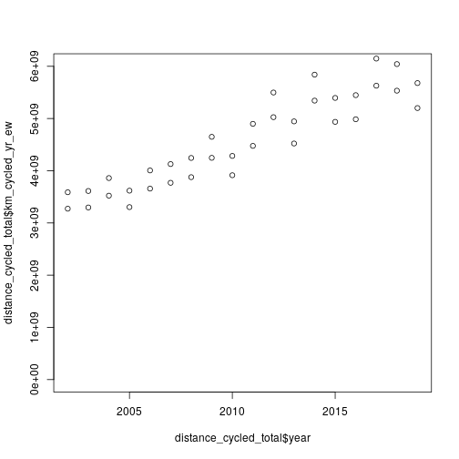

```r
# Aim: estimate cycling levels across England and Wales
library(tidyverse)
```

```
## ── Attaching packages ───────────────────────────────────────────── tidyverse 1.3.0 ──
```

```
## ✔ ggplot2 3.3.2     ✔ purrr   0.3.4
## ✔ tibble  3.0.4     ✔ dplyr   1.0.2
## ✔ tidyr   1.1.2     ✔ stringr 1.4.0
## ✔ readr   1.4.0     ✔ forcats 0.5.0
```

```
## ── Conflicts ──────────────────────────────────────────────── tidyverse_conflicts() ──
## ✖ dplyr::filter() masks stats::filter()
## ✖ dplyr::lag()    masks stats::lag()
```

```r
u = "https://www.ons.gov.uk/generator?format=csv&uri=/peoplepopulationandcommunity/populationandmigration/populationestimates/timeseries/enpop/pop"
population_england = readr::read_csv(u, skip = 7)
```

```
## Warning: Missing column names filled in: 'X2' [2]
```

```
## 
## ── Column specification ──────────────────────────────────────────────────────────────
## cols(
##   `Important notes` = col_double(),
##   X2 = col_double()
## )
```

```r
population_england
```

```
## # A tibble: 49 x 2
##    `Important notes`       X2
##                <dbl>    <dbl>
##  1              1971 46411700
##  2              1972 46571900
##  3              1973 46686200
##  4              1974 46682700
##  5              1975 46674400
##  6              1976 46659900
##  7              1977 46639800
##  8              1978 46638200
##  9              1979 46698100
## 10              1980 46787200
## # … with 39 more rows
```

```r
names(population_england) = c("year", "population")
readr::write_csv(population_england, "small-output-datasets/population_england.csv")
```

```
## Warning in open.connection(file, "wb"): cannot open file 'small-output-datasets/
## population_england.csv': No such file or directory
```

```
## Error in open.connection(file, "wb"): cannot open the connection
```

```r
# percent of population living in wales given that its population is ~3.1 million
u = "https://www.ons.gov.uk/generator?format=csv&uri=/peoplepopulationandcommunity/populationandmigration/populationestimates/timeseries/wapop/pop"
population_wales = readr::read_csv(u, skip = 7)
```

```
## Warning: Missing column names filled in: 'X2' [2]
```

```
## 
## ── Column specification ──────────────────────────────────────────────────────────────
## cols(
##   `Important notes` = col_double(),
##   X2 = col_double()
## )
```

```r
population_england$population_wales = population_wales[[2]]
population_england$wales_multiplier = (population_england$population + population_england$population_wales) / population_england$population
plot(population_england$wales_multiplier)
```


```r
# percent of population living in scotland given that its population is ~3.1 million
u = "https://www.ons.gov.uk/generator?format=csv&uri=/peoplepopulationandcommunity/populationandmigration/populationestimates/timeseries/scpop/pop"
population_scotland = readr::read_csv(u, skip = 7)
```

```
## Warning: Missing column names filled in: 'X2' [2]
```

```
## 
## ── Column specification ──────────────────────────────────────────────────────────────
## cols(
##   `Important notes` = col_double(),
##   X2 = col_double()
## )
```

```r
population_england$population_scotland = population_scotland[[2]]
population_england$scotland_multiplier = (population_england$population + population_england$population_scotland) / population_england$population
plot(population_england$scotland_multiplier)
```


```r
u = "https://assets.publishing.service.gov.uk/government/uploads/system/uploads/attachment_data/file/905948/nts0303.ods"
f = basename(u)
download.file(u, f)
nts_data = readODS::read_ods(f, skip = 100)
nts_dist = nts_data[1:17, ]
nts_dist
```

```
##                        Mode               2002       2003       2004       2005
## 1                  Private:               <NA>         NA         NA         NA
## 2                     Walk1 206.39954542688699  211.03087  214.99858  209.28787
## 3      Walks of over a mile   116.853433154577  118.81906  120.27459  112.47446
## 4                   Bicycle    38.642981606126   38.72957   41.16488   38.29270
## 5          Car / van driver 3694.0750361410301 3692.42253 3660.23824 3645.83371
## 6       Car / van passenger 2114.6016535533499 2092.25662 1993.36457 2064.89189
## 7                Motorcycle 36.099062866798903   44.68530   39.10380   37.89384
## 8  Other private transport3   144.562241530694  152.37859  147.40486  152.85734
## 9                   Public:               <NA>         NA         NA         NA
## 10            Bus in London   64.7467815208296   69.11331   68.50533   78.22874
## 11          Other local bus   210.570741907534  207.34529  194.08310  187.91526
## 12            Non-local bus 61.489305135750598   87.94586   70.55378   80.92644
## 13       London Underground 93.333302038967005   78.77664   78.77452   77.62261
## 14             Surface Rail 436.42146748881203  404.57145  454.56098  479.39429
## 15           Taxi / minicab 57.566130305627198   55.23423   50.17749   59.41512
## 16  Other public transport4 34.922648963407497   76.60019   47.34793   69.86521
## 17                All modes 7193.4308984858098 7211.09045 7060.27807 7182.42503
##          2006       2007       2008       2009       2010       2011       2012
## 1          NA         NA         NA         NA         NA         NA         NA
## 2   213.94540  201.36017  201.34888  207.70809  193.25833  197.29092  190.31598
## 3   113.06151  111.32435  112.34815  112.42873  104.33479  108.67741  103.04468
## 4    42.10530   43.04421   43.90701   47.75412   43.64774   49.49108   55.18475
## 5  3657.02308 3657.92467 3486.68953 3279.74748 3388.49375 3386.42341 3305.03744
## 6  1989.76236 2002.65375 1952.72121 1983.53932 1836.32940 1960.25950 1833.45269
## 7    36.99565   35.91286   38.65128   37.51121   28.75033   36.74011   39.08084
## 8   110.38957  105.58040  110.73163  140.68402  120.80732  125.22096   92.71891
## 9          NA         NA         NA         NA         NA         NA         NA
## 10   73.33157   77.96786   79.60082   82.05253   93.87537   80.98793   77.00930
## 11  214.68825  214.66094  215.54415  209.75929  200.52487  206.41349  216.56430
## 12   58.44848   61.31077   51.76068   46.93895   63.41361   50.67412   64.39985
## 13   85.81296   81.78461   86.30689   89.57607   84.48963   77.49883   82.89431
## 14  495.87887  520.86150  504.52200  489.15452  534.50228  498.31909  568.67561
## 15   53.45365   54.00649   52.55010   53.73709   51.90744   54.94768   52.82136
## 16   76.67441   75.82104   63.65768   48.31204   57.55157   39.88555   29.20741
## 17 7108.50954 7132.88927 6887.99186 6716.47473 6697.55163 6764.15268 6607.36276
##          2013       2014       2015       2016       2017       2018       2019
## 1          NA         NA         NA         NA         NA         NA         NA
## 2   195.47735  189.62583  192.26254  198.17972  205.95542  209.69307  204.53120
## 3   109.72476  102.54217  106.18103   94.84393   96.94078   96.84402  100.23295
## 4    49.31655   57.80215   52.96590   53.04451   59.50757   58.13646   54.34368
## 5  3235.41248 3276.26922 3266.39968 3289.10668 3276.31374 3252.77687 3197.80169
## 6  1865.09870 1790.91602 1892.77144 1789.95197 1827.44215 1783.33342 1811.67954
## 7    31.02504   30.28893   30.02008   34.10422   36.12110   25.76410   17.40299
## 8   122.55343  106.35159   97.83527   93.17874   97.25108  108.24522  108.23924
## 9          NA         NA         NA         NA         NA         NA         NA
## 10   82.27718   77.30109   85.77100   61.28574   77.70639   61.74624   72.50376
## 11  200.48258  198.76518  202.41193  179.13788  179.84462  173.22504  158.20088
## 12   48.12572   49.74594   45.96667   50.85827   57.59764   39.18272   38.83201
## 13   82.63566   94.15674   89.63155   97.35553  101.82010  102.29681  108.85217
## 14  567.45785  540.06796  594.85736  538.47694  558.44309  616.54398  624.85355
## 15   54.48433   55.82720   54.67627   58.20430   54.87552   62.48103   59.30023
## 16   58.11176   29.22279   51.90539   56.05747   47.57449   36.67214   43.00857
## 17 6592.45864 6496.34065 6657.47508 6498.94195 6580.45291 6530.09710 6499.54952
```

```r
sapply(nts_dist, class)
```

```
##        Mode        2002        2003        2004        2005        2006        2007 
## "character" "character"   "numeric"   "numeric"   "numeric"   "numeric"   "numeric" 
##        2008        2009        2010        2011        2012        2013        2014 
##   "numeric"   "numeric"   "numeric"   "numeric"   "numeric"   "numeric"   "numeric" 
##        2015        2016        2017        2018        2019 
##   "numeric"   "numeric"   "numeric"   "numeric"   "numeric"
```

```r
nts_dist[[2]] = as.numeric(nts_dist[[2]])
nts_dist_long = tidyr::pivot_longer(nts_dist, !Mode, names_to = "year", values_to = "miles_person_yr")

population_england$year = as.character(population_england$year)
distance_cycled = nts_dist_long %>%
  filter(Mode == "Bicycle")
distance_cycled_joined = inner_join(distance_cycled, population_england)
```

```
## Joining, by = "year"
```

```r
distance_cycled_total = distance_cycled_joined %>%
  mutate(km_cycled_yr_ew = miles_person_yr * population * wales_multiplier * 1.61)
distance_cycled_total # in 2011: 4475741485
```

```
## # A tibble: 18 x 9
##    Mode  year  miles_person_yr population population_wales wales_multiplier
##    <chr> <chr>           <dbl>      <dbl>            <dbl>            <dbl>
##  1 Bicy… 2002             38.6   49679300          2922900             1.06
##  2 Bicy… 2003             38.7   49925500          2937700             1.06
##  3 Bicy… 2004             41.2   50194600          2957400             1.06
##  4 Bicy… 2005             38.3   50606000          2969300             1.06
##  5 Bicy… 2006             42.1   50965200          2985700             1.06
##  6 Bicy… 2007             43.0   51381100          3006300             1.06
##  7 Bicy… 2008             43.9   51815900          3025900             1.06
##  8 Bicy… 2009             47.8   52196400          3038900             1.06
##  9 Bicy… 2010             43.6   52642500          3050000             1.06
## 10 Bicy… 2011             49.5   53107200          3063800             1.06
## 11 Bicy… 2012             55.2   53493700          3074100             1.06
## 12 Bicy… 2013             49.3   53865800          3082400             1.06
## 13 Bicy… 2014             57.8   54316600          3092000             1.06
## 14 Bicy… 2015             53.0   54786300          3099100             1.06
## 15 Bicy… 2016             53.0   55268100          3113200             1.06
## 16 Bicy… 2017             59.5   55619400          3125200             1.06
## 17 Bicy… 2018             58.1   55977200          3138600             1.06
## 18 Bicy… 2019             54.3   56287000          3152900             1.06
## # … with 3 more variables: population_scotland <dbl>, scotland_multiplier <dbl>,
## #   km_cycled_yr_ew <dbl>
```

```r
summary(distance_cycled_total$km_cycled_yr_ew)
```

```
##      Min.   1st Qu.    Median      Mean   3rd Qu.      Max. 
## 3.273e+09 3.685e+09 4.361e+09 4.362e+09 5.016e+09 5.628e+09
```

```r
# Min.   1st Qu.    Median      Mean   3rd Qu.      Max.
# 3.273e+09 3.685e+09 4.361e+09 4.362e+09 5.016e+09 5.628e+09
distance_cycled_total = distance_cycled_total %>%
  mutate(km_cycled_yr_gb = miles_person_yr * (population + population_wales + population_scotland) * 1.61)
plot(distance_cycled_total$year, distance_cycled_total$km_cycled_yr_ew, ylim = c(0, 6e9))
points(distance_cycled_total$year, distance_cycled_total$km_cycled_yr_gb, ylim = c(0, 6e9))
```



```r
summary(distance_cycled_total$km_cycled_yr_gb)
```

```
##      Min.   1st Qu.    Median      Mean   3rd Qu.      Max. 
## 3.588e+09 4.036e+09 4.774e+09 4.771e+09 5.485e+09 6.148e+09
```

```r
readr::write_csv(distance_cycled_total, "small-output-datasets/distance_cycled_total.csv")
```

```
## Warning in open.connection(file, "wb"): cannot open file 'small-output-datasets/
## distance_cycled_total.csv': No such file or directory
```

```
## Error in open.connection(file, "wb"): cannot open the connection
```

