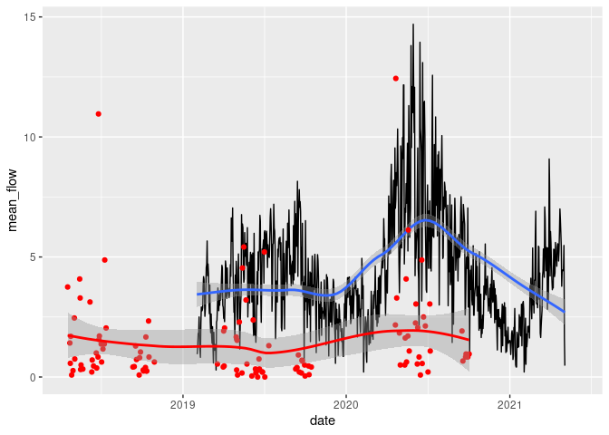

LA data analysis
================

The starting point of this analysis is [Bradford data
analysis](https://github.com/saferactive/saferactive/blob/master/code/tests/bradford.md)
which compares the DfT’s sporadic but widely spread-out manual count
data with data from three automatic cycle counters in Bradford, with
aggregate results shown in the figure below.

<!-- -->

The aim of this document is to build on that by including more local
authorities in the analysis.

The map below shows the geographic distribution of countpoints
associated with the local authorities of interest:

    ## [1] "Bradford"    "Leeds"       "Derby"       "Southampton"

<!-- -->

The temporal trend of the manual counts is as follows:

<!-- -->

<!-- -->

Plots showing all counter point trends in the case study local
authorities, and average counter values per year are shown in the graph
below.

    ## 
    ##    12    23    24    36    46    47    48    60    72    96   119   120   142 
    ##   168    23 16680   360    46    47 22992    60  8712 16800   119  9120   142 
    ##   143   144   167   168   180   191   192   204   216   238   239   240   263 
    ##   143 20160   167 17976   180   191 15360   204 16848   238   239 48720   526 
    ##   264   288   311   312   334   335   336   360   384   408   430   432   456 
    ## 52536 14688   311  2184   668   335 18480  3240  6528  3264  1290 11232  2736 
    ##   478   480   504   526   528   576   624   672   720   816   864   912 
    ##   478 25440   504  1052 41184  4032  4368   672  2880   816  2592  2736

    ## 
    ##    Bradford       Derby       Leeds Southampton 
    ##       88549       20400      152119      139399

    ## 
    ##    Bradford       Derby       Leeds Southampton 
    ##           2           3           9           7

    ##    Min. 1st Qu.  Median    Mean 3rd Qu.    Max. 
    ##    2000    2005    2009    2010    2015    2020

    ## [1] 2739

<!-- -->

Plotting this per LA suggests cycling uptake during the pandemic has
been variable.

    ##       Year          Cycles          name          
    ##  Min.   :2003   Min.   :1.626   Length:3          
    ##  1st Qu.:2007   1st Qu.:1.686   Class :character  
    ##  Median :2011   Median :1.745   Mode  :character  
    ##  Mean   :2009   Mean   :1.786                     
    ##  3rd Qu.:2012   3rd Qu.:1.865                     
    ##  Max.   :2012   Max.   :1.985

<!-- -->

## Automatic count data
