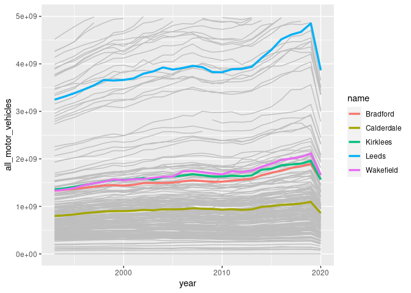
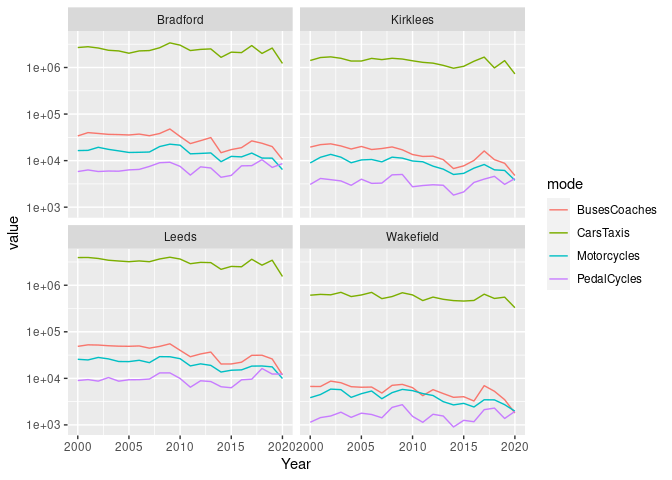
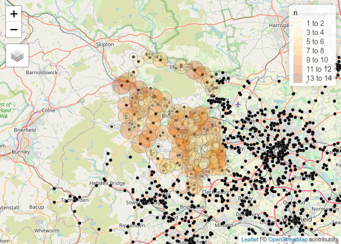
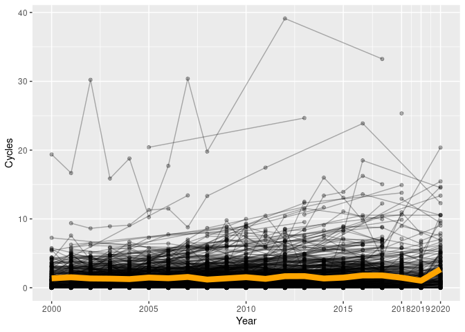
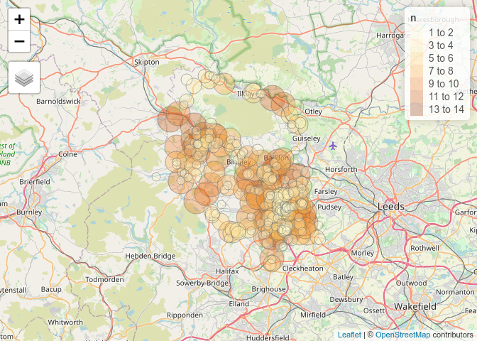
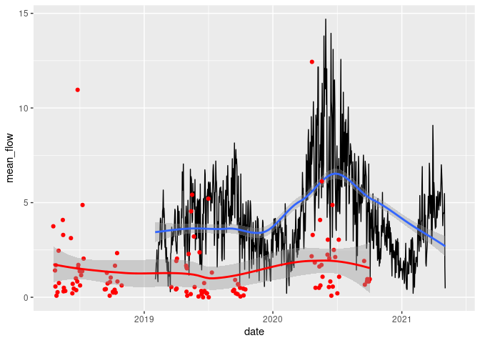

Bradford data analysis
================

``` r
library(tidyverse)
library(tmap)
tmap_mode("view")
```

## Raw counter data

Data from the DfT’s manual count dataset was obtained using code hosted
at <https://github.com/ITSLeeds/dftTrafficCounts>

``` r
remotes::install_github("ITSLeeds/dftTrafficCounts")
```

    ## Using github PAT from envvar GITHUB_PAT

    ## Skipping install of 'dftTrafficCounts' from a github remote, the SHA1 (dacb7edd) has not changed since last install.
    ##   Use `force = TRUE` to force installation

``` r
library(dftTrafficCounts)
```

Aggregated local authority data can be obtained and plotted as follows:

``` r
d_las = dtc_import_la()
```

    ## Rows: 5,734
    ## Columns: 9
    ## Delimiter: ","
    ## chr [2]: name, ons_code
    ## dbl [7]: region_id, local_authority_id, year, link_length_km, link_length_miles, cars_an...
    ## 
    ## Use `spec()` to retrieve the guessed column specification
    ## Pass a specification to the `col_types` argument to quiet this message

``` r
head(d_las$name)
```

    ## [1] "Hartlepool"           "Middlesbrough"        "Redcar and Cleveland"
    ## [4] "Stockton-on-Tees"     "Darlington"           "Halton"

``` r
las_of_interest = c("Leeds", "Bradford", "Wakefield", "Calderdale", "Kirklees")
d_las_of_interest = d_las %>%
   filter(name %in% las_of_interest)
d_las %>% 
  ggplot() +
  geom_line(aes(year, all_motor_vehicles, group = name), colour = "grey") +
  geom_line(aes(year, all_motor_vehicles, colour = name), data = d_las_of_interest, size = 1.2) +
  ylim(c(0, 5e9))
```

    ## Warning: Removed 174 row(s) containing missing values (geom_path).

<!-- -->

Counter level data can be obtained with the following commands, which
downloads and reads in data representing 4.5 million manual count
records, as of June 2021 (warning requires a decent computer):

``` r
u = "http://data.dft.gov.uk/road-traffic/dft_traffic_counts_raw_counts.zip"
d = dtc_import(u = u)
nrow(d)
#> 4491805
summary(d$count_date)
#                  Min.               1st Qu.                Median                  Mean               3rd Qu. 
# "2000-03-17 00:00:00" "2005-06-14 00:00:00" "2009-09-24 00:00:00" "2010-06-22 13:06:26" "2015-10-07 00:00:00" 
#                  Max.                  NA's 
# "2020-11-03 00:00:00"                 "129" 
d_year_count = d %>% count(Year)
d_year_count %>% filter(Year > 2010)
# # A tibble: 10 x 2
#     Year      n
#    <dbl>  <int>
#  1  2011 187628
#  2  2012 188765
#  3  2013 188469
#  4  2014 157518
#  5  2015 161961
#  6  2016 166823
#  7  2017 186464
#  8  2018 289827
#  9  2019 301924
# 10  2020 154783
```

Let’s subset this data to include only LAs of interest from 2011 to 2020

``` r
d_sample_points = d %>% 
  group_by(CP) %>% 
  summarise(n_records = n(),
            LocalAuthority = median(LocalAuthority),
            Easting = median(Easting),
            e = Easting,
            Northing = median(Northing),
            n = Northing
            )
# 105,798 unique records, 42k ignoring direction

d_sf = d_sample_points %>% 
  ungroup() %>% 
  na.omit() %>% 
  sf::st_as_sf(coords = c("e", "n"), crs = 27700) %>% 
  sf::st_transform(4326)
plot(d_sf$geometry)

las = ukboundaries::lad2018
las_to_join = las %>% 
  select(name = lau118nm)

d_to_join = sf::st_join(d_sf, las_to_join) %>% 
  sf::st_drop_geometry()

d_joined = inner_join(d, d_to_join)
d_joined_bradford = d_joined %>% 
  filter(name == "Bradford") %>% 
  filter(Year > 2017)

d_counter_summaries = d_joined %>% 
  group_by(CP, Easting, Northing, Year) %>% 
  summarise(
    n = n(),
    Cycles = mean(PedalCycles),
    HGVs = mean(AllHGVs),
    Motors = mean(AllMotorVehicles),
    LocalAuthority = median(LocalAuthority),
    name = first(as.character(name))
    )
# ~400k records, ~200k ignoring direction

d_counter_west_yorks = d_counter_summaries %>% 
  filter(name %in% las_of_interest)
saveRDS(d_counter_west_yorks, "dft_traffic_count_d_counter_west_yorks.Rds")

d_sample = d_joined %>% filter(name %in% las_of_interest)
d_summary_la = d_sample %>%
  select(PedalCycles:BusesCoaches | matches("Year|name")) %>% 
  group_by(Year, name) %>%
  summarise_all(sum, na.rm = TRUE) %>%
  tidyr::pivot_longer(cols = PedalCycles:BusesCoaches, names_to = "mode")
```

``` r
u = "https://github.com/saferactive/saferactive/releases/download/0.1.4/dft_traffic_counts_d_summary_la.Rds"
d_summary_la = readRDS(url(u))
ggplot(d_summary_la) +
  geom_line(aes(Year, value, colour = mode)) +
  facet_wrap(~name) +
  scale_y_log10()
```

<!-- -->

We can observe individual counter points as follows:

``` r
u = "https://github.com/saferactive/saferactive/releases/download/0.1.4/dft_traffic_count_d_counter_west_yorks.Rds"
counters_year = readRDS(url(u))
counters_sf = counters_year %>% 
  group_by(Easting, Northing) %>% 
  summarise(n = n(), LA = first(name)) %>% 
  sf::st_as_sf(coords = c("Easting", "Northing"), crs = 27700)
```

    ## `summarise()` has grouped output by 'Easting'. You can override using the `.groups` argument.

``` r
counters_bradford = counters_sf %>% filter(LA == "Bradford")
qtm(counters_sf, bbox = sf::st_bbox(counters_bradford), basemaps = leaflet::providers$OpenStreetMap.Mapnik) +
  tm_shape(counters_bradford) +
  tm_dots(size = "n", col = "n", alpha = 0.3) 
```

    ## Legend for symbol sizes not available in view mode.

<!-- -->

``` r
# nrow(counters_bradford)
```

There are 1273 counters in Bradford, but only 225 with at least 2
readings since 2017. These are plotted below.

    ##    Min. 1st Qu.  Median    Mean 3rd Qu.    Max. 
    ##    2000    2005    2009    2010    2015    2020

    ## [1] 1273

    ## Warning: Removed 1 rows containing missing values (geom_point).

<!-- -->

## Automatic count data

The location of auto count points, compared with the location of manual
counts in Bradford, is shown below.

``` r
# auto_counts = readr::read_csv("code/tests/daily_cycle_data_bfd.csv")
auto_counts = readr::read_csv("daily_cycle_data_bfd.csv")
```

    ## 
    ## ── Column specification ────────────────────────────────────────────────────────
    ## cols(
    ##   SiteID = col_character(),
    ##   date = col_date(format = ""),
    ##   count_vehicles = col_double(),
    ##   hourly_mean_flow = col_double(),
    ##   Site_Name = col_character(),
    ##   name_2 = col_character(),
    ##   Speed_Limit = col_double(),
    ##   Orientation = col_character(),
    ##   Grid = col_double(),
    ##   latitude = col_double(),
    ##   longitude = col_double(),
    ##   data_type = col_character()
    ## )

``` r
auto_count_locations = auto_counts %>% 
  group_by(longitude, latitude) %>% 
  summarise(mean_flow = mean(hourly_mean_flow)) %>% 
  sf::st_as_sf(coords = c("longitude", "latitude"), crs = 4326)
```

    ## `summarise()` has grouped output by 'longitude'. You can override using the `.groups` argument.

``` r
plot(auto_count_locations$geometry)
```

<!-- -->

``` r
qtm(auto_count_locations, bbox = sf::st_bbox(counters_bradford), basemaps = leaflet::providers$OpenStreetMap.Mapnik) +
  tm_shape(counters_bradford) +
  tm_dots(size = "n", col = "n", alpha = 0.3) 
```

    ## Legend for symbol sizes not available in view mode.

<!-- -->

Their temporal trends are compared below.

``` r
manu_counts = d_joined_bradford %>% 
  group_by(count_date = lubridate::ymd(count_date)) %>% 
  summarise(mean_flow = mean(PedalCycles, na.rm = TRUE))

auto_counts %>% 
  group_by(date) %>% 
  summarise(mean_flow = mean(hourly_mean_flow, na.rm = TRUE)) %>% 
  ggplot() +
  geom_line(aes(date, mean_flow)) +
  geom_smooth(aes(date, mean_flow)) +
  geom_point(aes(count_date, mean_flow), data = manu_counts, colour = "red") +
  geom_smooth(aes(count_date, mean_flow), data = manu_counts, colour = "red") 
```

    ## `geom_smooth()` using method = 'loess' and formula 'y ~ x'

    ## Warning: Removed 27 rows containing non-finite values (stat_smooth).

    ## `geom_smooth()` using method = 'loess' and formula 'y ~ x'

    ## Warning: Removed 27 row(s) containing missing values (geom_path).

<!-- -->
