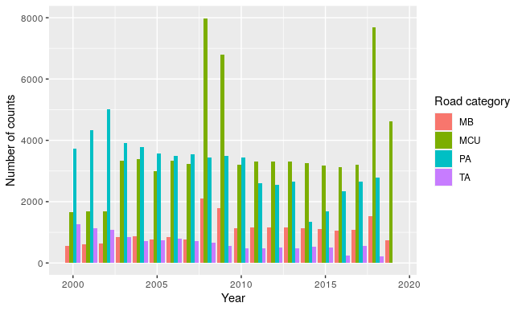

<!-- Strategy: submit it to Transportation Research Part D -->

```{r setup, include=FALSE}
knitr::opts_chunk$set(echo = TRUE)
```

# Abstract

Using cycle count data from the UK's Department for Transport, we develop a GAM model to predict temporal and spatial variation in cyclist numbers on British roads. 
Our model predictions closely correlate with an independent set of cycle count data. 
These results can be used as correction factors to compare counts taken at different times.

# Introduction

In view of the major global challenges of climate change, poor health, air pollution and traffic congestion, cycling is increasingly seen as important solution. 
Recognition of cycling’s importance has further grown in light of the impacts of the Covid-19 pandemic. 
As a means of travel cycling allows for social distancing.
During national lockdowns, large numbers of people took up or returned to cycling, for exercise or to undertake necessary journeys in a safe manner (ref). 
They were encouraged in this by streets which were relatively car-free.
However, with public transport capacity remaining limited, private car usage has since risen as countries have emerged from lockdown (ref), risking a return to high levels of air pollution and congestion.

Air pollution is linked with a range of diseases, including respiratory conditions such as asthma (ref). 
Studies are emerging highlighting a potential role of air pollution in increasing susceptibility to Covid-19 infection (ref) or increased morbidity (ref). 
Inactivity is also associated with numerous physical and mental health conditions (ref). 
Incorporating active travel into daily journeys combats this.

To enable the continuance of this step change in cycling rates, major changes to urban street design are needed so that, even with rising traffic levels, people who wouldn’t have previously cycled feel safe to do so.

For this to happen it is necessary to know where and when people are cycling.
Which are the key cycle flows and desire lines?
How do these relate to crash rates and collision hotspots?
Who are the main users of these streets, including people on foot, on bicycles or in other types of vehicles?
Where are there opportunities to improve cycle provision?
To answer all of these questions, we need to have reliable cycle count data.

# Open cycle counter datasets

Traffic counts are commonly used to monitor road networks.
In the UK counts cover all major roads and a selection of minor roads. 

There are various types of traffic count. 
Screen lines monitor the number of vehicles passing a given line; this may involve conducting counts on two or more parallel streets.
Point counts monitor vehicles at a particular point such as a junction; this may involve recording the different paths vehicles take through the junction.
Counts can be manual or automatic.


## Department for Transport road traffic statistics 

The UK's Department for Transport maintains a database of road traffic statistics based on manual hourly point counts, which it makes available in an interactive map and for [bulk download](https://roadtraffic.dft.gov.uk/downloads)
<!-- , in .zip and .csv formats, -->
at [roadtraffic.dft.gov.uk](https://roadtraffic.dft.gov.uk).
These counts are taken on weekdays, from March to early November. 
The counts avoid school holiday periods such as August and late July. 


## Transport for London

For the period 2014-2019, 1.3 million cycle counts are available from Transport for London, covering streets across the capital. 
These are released as open data by TfL, available at [cycling.data.tfl.gov.uk](https://cycling.data.tfl.gov.uk/).

## Local cycle counter schemes

**Bristol**...

**York**
York has a network of over 40 Automatic Cycle Counters. These are inductive loops placed in the cycleway or highway, which record the number of cycles passing over them. Data from these counters can be accessed at [data.gov.uk](https://data.gov.uk/dataset/eac3af51-37e4-4f99-97c3-6cd2994b9acc/automatic-cycle-counters).


# Methodology


<!-- ## Exploratory data analysis -->

The national cycle count dataset contains 4.5 million unique hourly records from the years 2000 to 2019, covering England, Wales and Scotland. 
We fixed errors in location data and removed a small number of records where hour was incorrectly recorded. 
Removing motorways and combining bidirectional flows, this translates to 2.1 million hourly records comprising 175,000 daily count points. 
Each count point contains 12 hours of count data, covering the hours 07:00-19:00. 

Exploratory investigation (Figure \@ref(fig:annual)) reveals that around 7000-9000 daily counts were made in most years (mean 8782), but this ranged from 5368 counts in 2019 to 14629 counts in 2008. 
However, the category of roads surveyed varied greatly from year to year. 
In the years with greater numbers of counts (2008, 2009 and 2018), these additional counts came entirely from minor roads - B roads, C roads and unclassified roads. 
In 2019, no counts from Principal A roads or Trunk A roads were recorded.   

```{r annual, fig.cap = "Number of cycle count locations per year, classified by road category. MB = B road; MCU = C or Unclassified road, PA = Principal A road; TA = Trunk A road"}

```

Recorded bicycle numbers vary greatly with road category. They are highest on Principal A roads (mean 11.0 bicycles/hour) and lowest on Trunk A roads (mean 1.08 bicycles/hour)....


<!-- ## Univariate models -->


<!-- ## Multivariate -->


<!-- ## Time series analysis -->

## General additive models

We use a GAM model with a negative binomial distribution.

A set of smooth terms are used within the model to represent the temporal and spatial variation of the cycle counts.
The temporal parameters are year, day of year (a measure of seasonality) and hour of day.

Hour and year use thin plate splines, while day of year has a cubic regression spline.
The cubic regression spline is characterised by a relatively low number of knots, evenly spread through the covariate values.
This prevents overfitting, which can be an issue with GAM models.
The data we used contained very few counts from the the final week of the season, and other forms of spline tended to overfit to these counts in particular.
We used three knots for this spline.

A two-dimensional duchon spline is used as a spatial parameter, measured as British National Grid eastings and northings. 

The model includes tensor product interaction smooths; these act as interaction terms for variables whose main effect has already been included in the model. 
We include the interaction between year and space, and between hour and space. 
To maintain simplicity, an interaction term between day of year and space was not included.

The partial effects of each smooth term are shown in Figure \@ref(fig:ksi). 

```{r ksi, fig.cap="Test caption"}
knitr::include_graphics("figures/cycle-KSI-bkm.png")
```

### Model predictions

Using this model we generate predictions for the full range of each parameter for which data is available. 


### Correction factors
Together with cycle count data from a given locality, our model predictions can be used to produce correction factors. 
It is then possible to predict the expected counts at the same location, for different points in time. 
For example, given count data from 08:00 - 09:00 on a day in April 2010, the expected number of cyclists passing the same location at 15:00 - 16:00 in September 2015 could be inferred.

To calculate the correction factors, each hourly total from the existing count is divided by the model prediction for the same location and time period. 
The mean correction factor is then multiplied by the model prediction for the time period desired.


## Estimation of confidence intervals

<!-- ## R function -->

<!-- We have written an R function that computes these predictions.  -->

<!-- The input to this is cycle count data from a given location and time period, covering at least one hour. The function if flexible as to the number of hours of data to be inputted. Each hour of input data contributes to mean correction factors, which are then used to estimate   -->

## Model training

Exclude 10% of points to test and train model

## Model validation using independent data set

TfL cycle counters

# Results


# Implementation

The aim was to enable anyone in the UK (and beyond) to translate sporadic and relatively low value counts into standard units such as annual, daily and peak hour flows.
These in turn can be converted into real-world outputs such as design standards (e.g. minimum width) [@parkin_designing_2018] and estimated health impacts used to prioritise schemes.

For the assessment of cycle infrastructure schemes, for example through [the Department for Transport's Active Mode Appraisal Toolkit](https://www.gov.uk/government/publications/tag-unit-a5-1-active-mode-appraisal), it is important to be able to estimate the expected usership of the new infrastructure. 
Our methods may make this easier, by enabling the generalisation of any existing cycle count data which provides a suitable local example of cycle flows.


# Discussion

# References
