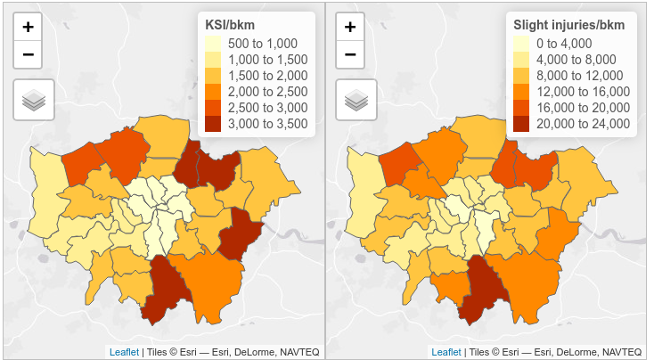

<!-- Strategy: submit it to Transportation Research Part D -->

```{r setup, include=FALSE}
knitr::opts_chunk$set(echo = TRUE)
```

# Abstract

Using cycle count data from the UK's Department for Transport, we develop a GAM model to predict temporal and spatial variation in cyclist numbers on UK roads. 
Our model predictions closely correlate with an independent set of cycle count data. 
These results can be used as correction factors to compare counts taken at different times.

# Introduction

In view of the major global challenges of climate change, poor health, air pollution and traffic congestion, cycling is increasingly seen as important solution. 

# Open cycle counter datasets

## Department for Transport road traffic statistics 

The UK's Department for Transport maintains a database of road traffic statistics based on manual hourly point counts, which it makes available in an interactive map and for [bulk download](https://roadtraffic.dft.gov.uk/downloads)
<!-- , in .zip and .csv formats, -->
at [roadtraffic.dft.gov.uk](https://roadtraffic.dft.gov.uk).


## Transport for London

## Local cycle counter schemes

**Bristol**...

# Methodology


<!-- ## Exploratory data analysis -->


<!-- ## Univariate models -->


<!-- ## Multivariate -->


<!-- ## Time series analysis -->

## General additive models


We use a GAM model with a negative binomial distribution.

A set of smooth terms are used within the model to represent the temporal and spatial variation of the cycle counts.
The temporal parameters are year, day of year (a measure of seasonality) and hour of day.

Hour and year use thin plate splines, while day of year has a cubic regression spline.
The cubic regression spline is characterised by a relatively low number of knots, evenly spread through the covariate values.
This prevents overfitting, which can be an issue with GAM models.
The data we used contained very few counts from the the final week of the season, and other forms of spline tended to overfit to these counts in particular.
We used three knots for this spline.

A two-dimensional duchon spline is used as a spatial parameter, measured as British National Grid eastings and northings. 

The model includes tensor product interaction smooths; these act as interaction terms for variables whose main effect has already been included in the model. 
We include the interaction between year and space, and between hour and space. 
To maintain simplicity, an interaction term between day of year and space was not included.

The partial effects of each smooth term are shown in Figure \@ref(fig:ksi). 

```{r ksi, fig.cap="Test caption"}

```

Using this model we generate predictions for the full range of each parameter for which data is available. 


With cycle count data from a given locality, these predictions can be used to produce correction factors. It is then possible to predict the expected counts at different points in time. For example, given count data from 08:00 - 09:00 on a day in April 2010, the expected number of cyclists passing the same location at 15:00 - 16:00 in September 2015 could be inferred.

## Estimation of confidence intervals

<!-- ## R function -->

<!-- We have written an R function that computes these predictions.  -->

<!-- The input to this is cycle count data from a given location and time period, covering at least one hour. The function if flexible as to the number of hours of data to be inputted. Each hour of input data contributes to mean correction factors, which are then used to estimate   -->

# Results


# Implementation

The aim was to enable anyone in the UK (and beyond) to translate sporadic and relatively low value counts into standard units such as annual, daily and peak hour flows.
These in turn can be converted into real-world outputs such as design standards (e.g. minimum width) [@parkin_designing_2018] and estimated health impacts used to prioritise schemes.


# Discussion

# References
