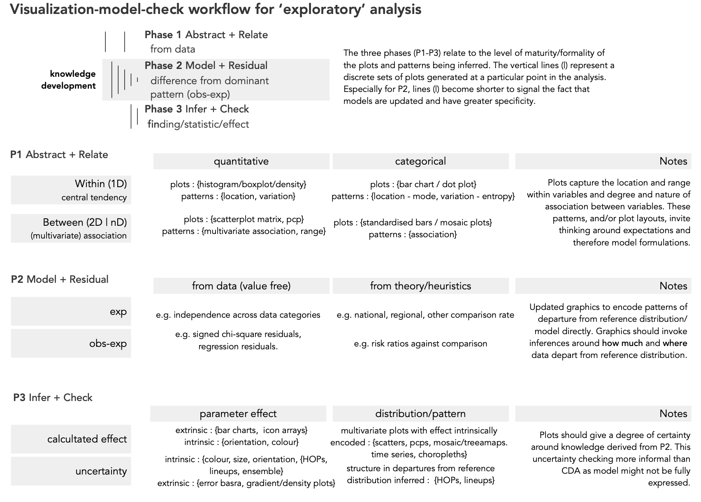

```{r, include=FALSE}
library(tidyverse)
library(kableExtra)
```

### STATS19 Road Crash Data

--


</img>
</img>


???

???

Starting point :
* research project on STATS19, canonical road safety dataset
* every crash resulting in inury in UK is recorded
* many variables, many ways of cutting data

Set of high level ambitions :
* Generating knowledge around contributing factors to pedestrain and cycle casualties
* Monitoring and evaluating crash rates between reporting areas and over time

Identified numerous interesting and complex patterns from exploring data, but ones that we have varying confidence in -- due to uncertainty around dataset, technique and reporting

So quite difficult to *claim knowledge* -- or to know where to stop in our exploratory analysis -- .


:
* doing comparison, uncertainty around the selection of denominators and other definitions;
* dominant patterns that appear  very salient due to some obvious confounding effect but not quite sure how to model for this
* when starting to condition on data to account for some of this confounding context, have high variability / low uncertainty due to diminishing sample size

---

### Science Reform


???

Struck me as typical in a lot of Data Science-type work, certainly in geography -- where repurposing data for analysis, and maybe looking at complex spatial processes for which there is not agreed/accepted technique -- for computation and reporting.

Science Reform --

Address Data Fishing

Two discrete phases -- Exploratory Data Analysis (EDA) and Confirmatory Data Analysis (CDA) -- and that only through CDA statistical findings are claimed using out-of-sample hypothesis tests.

But strict adherence to it may not guarantee strong Science with our data sets

May lead to staw-men null hypotheses


--
.pull-left[
</img>
]


.pull-right[.tiny-font[
> 1. That Reproducibility is the cornerstone of, or demarcation criteria for, Science
>
> 2. Using data more than once invalidates statistical inference (pre-registration)
>
> 3. Exploratory research uses 'wonky' statistics (EDA-CDA dichotomy)
]]

--
<br><br><br>

.pull-left[.small-font[
<b>Reproducing Data Fishing?</b>
]]

.pull-right[
.tiny-font[
> *More is learned from rejection of a complex model than from rejection of a trivial null model, such as a hypothesis that all effects are exactly zero.*
>
>     Hullman and Gelman, 2021
]]


---

### Retiring the EDA/CDA distinction

</img>

</img>


???

Interesting discussion from the vis / applied stats community about an enlarged EDA which is more model-focussed and concerned with generating complex models that also sensitive to false discovery


An expanded role for EDA ...
Really the risk -- when doing an EDA where generate loads of graphics that suggest at patterns -- that emphasise discovery -- is that of false discovery

* Visual data analysis as model formulation and critique : about helping to form comparisons and expectations -- and characterising variation from those expectations.

* That sometimes visual approaches may uniquely help with this because, especially when thinking about spatial analyses, where the sorts of detailed patterns being inferred cannot be correctly specified in advance, visualization may provide unique support


> EDA is often thought of as an alternative to model-based statistical analysis, but once we think of graphs as comparisons to models, it makes sense that the amount we’ve learned increases with the complexity of the model being compared to
> Hullman and Gelman 2021

---

### Framework for formalising an expanded EDA


</img>


???

Net of the dominant pattern

Data analysis for decision-making

---

### Framework for formalising an expanded EDA

</img>

</img>
